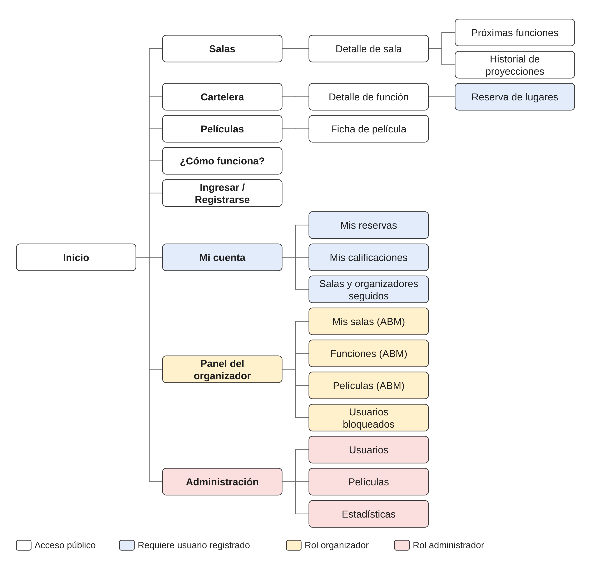

# Entrega 1 — Propuesta general y sitemap

Primera de las cuatro entregas del Trabajo Práctico Integrador de **Programación en Ambiente
Web** (11086 — UNLu). Fecha de entrega: 31/08.

## Qué pide la entrega

- La **propuesta general de la aplicación**, en forma de presupuesto funcional (qué va a hacer
  el sitio) y presupuesto temporal (cuánto trabajo estimamos que lleva).
- El **planteo del sitemap** del sitio, con un mínimo de 5 secciones.

## La aplicación: IndieCinema

**IndieCinema** es una plataforma web para organizar proyecciones de cine amateur e
independiente. Cualquier usuario registrado puede convertirse en organizador y dar de alta una
sala indie —un cineclub, un centro cultural, un espacio barrial o un evento puntual— y programar
funciones en ella. Los espectadores exploran las salas y la cartelera, siguen las salas y los
organizadores que les interesan, **votan** qué títulos se proyectan en cada función, reservan sus
lugares y, una vez terminada la función, la califican.

El presupuesto funcional está organizado en siete módulos: Usuarios y Acceso, Salas, Catálogo de
Películas, Funciones y Votación, Reservas, Calificaciones y Administración. El presupuesto temporal
estima **130 horas** de trabajo, alrededor de 43 por integrante.

## Sitemap

## Archivos

| Archivo | Descripción |
| --- | --- |
| [`propuesta-general-grupo-cerberus.docx`](propuesta-general-grupo-cerberus.docx) | Documento completo de la entrega |
| [`sitemap.svg`](sitemap.svg) | Sitemap — fuente vectorial editable |
| [`sitemap.png`](sitemap.png) | Sitemap exportado, tal como se incrusta en el documento |

## Integrantes — Grupo Cerberus

- Salvador Baez
- Mateo Nomico
- Tomás Resnik
